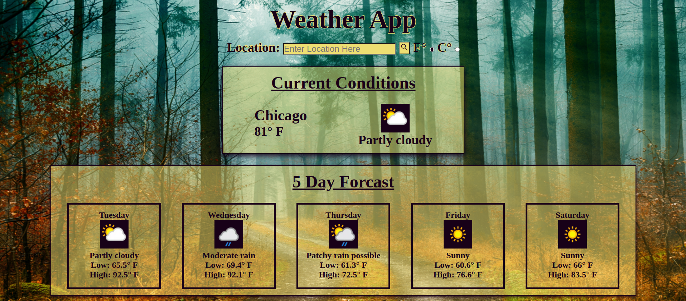

# Weather-App

**Objective**

I created a weather app using HTML, CSS, JavaScript, JSON, and webpack. The weather app allows users to search for a location and see the current conditions and five day forecast.

***Web App Images***

Fahrenheit Image:

Celsius Image:

***Features***

1. The weather app features a search bar where the user can enter the desired location. The user can enter any of the following to locate their desired location, US Zipcode, UK Postcode, Canada Postalcode, IP address, Latitude/Longitude (decimal degree) or city name.

2. The current conditions container tells the location's name that the user searched, the current tempreture, and current condition image/description.

3. The five day forecast container lists the day of the week for the location searched starting with the day the search is made and tells the user the overall daily condition with an image and description. The five day forecast container also shows the low and high for the day.

4. The user can select whether they would like to view the temperatures in fahrenheit or celsius by using the toggle located after the location text input. The F or C toggle will toggle all temperatures for the current and five day forecast. 

***Credits***

1. Background Image: Pexals.com Author: Johannes Plenio

2. Moment.js was used to configure the days of the week in the five day forecast.

3. I used Material Icons for the magnifing glass (submit button) icon.
